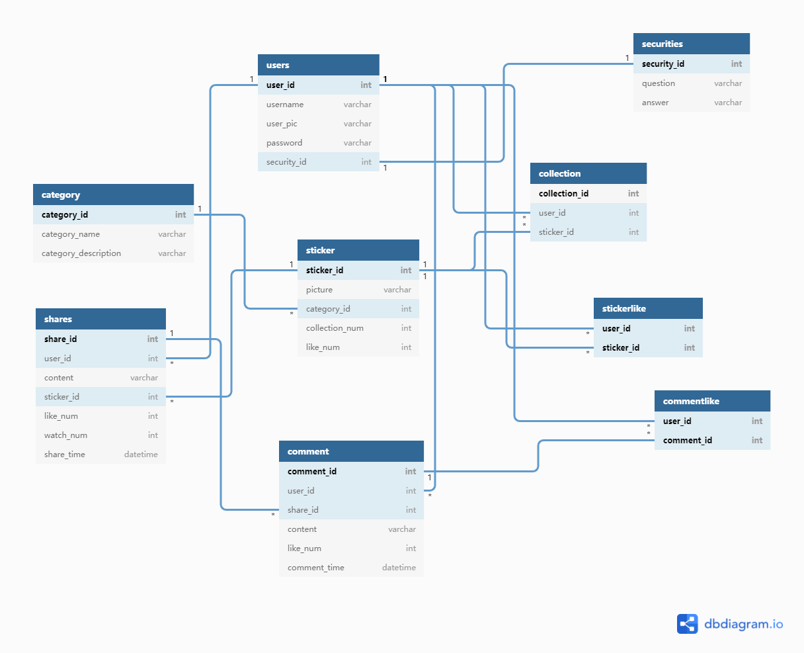

# 数据库大作业

## 概述
设计一个有分享，评论，分类，收藏功能的表情包分享站。

前端使用`vue3 + element plus + vue cli`， 后端使用`gin + gorm`，代理部署使用`nginx`

数据库 `opengauss`

缓存 `redis`

设计模式：
前后端分离模式，通过json数据进行交互

E-R图：


## build
前端部分：
进入vue文件夹，运行`npm run build`打包到`dist`文件夹当中

后端部分：
首先要建立conf文件夹，创建app.ini文件，具体格式如下
```
[server]
#debug or release
RunMode = debug
#端口号
HttpPort = 9000


[database]
User = gaussdb
Password = 
Host = 127.0.0.1
Port = 5432
Name = postgres

[redis]
Addr = 127.0.0.1:6379
Password = 
DB = 1
IdleTimeout = 200
```

然后执行`go build main.go`生成可执行文件

部署：
使用nginx部署，指定root目录位置为dist文件夹所在位置

同时要考虑前后端跨域问题，需要设置反向代理，设置配置文件

```nginx
    location / {
        root    XXXXXX; # dist文件夹所在位置
        index  index.html index.htm;
        #路由history模式下需要重定向到index.html,
        #否则会出现404
        try_files $uri $uri/ /index.html; 
        
    }

    # 反向代理    
    location /api/ {
        rewrite  ^.+api/?(.*)$ /$1 break;
        include  uwsgi_params;
        proxy_pass  http://127.0.0.1:9000;
    }
```

`start nginx`

修改配置后，需要重新加载配置文件 `nginx -s reload`