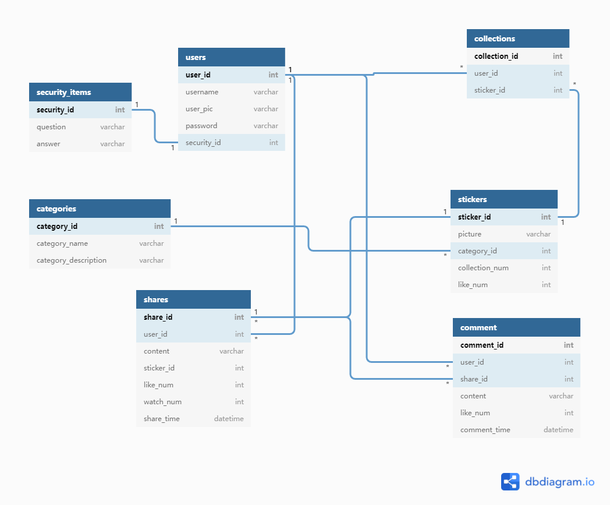

## E-R图设计

使用

[dbdiagram.io]: https://dbdiagram.io/

由表生成ER模型


**用户users：**

user_id：用户的id [PK]

username：用户名

user_pic: 用户头像 （存储图片的路径）

password：用户的密码

security_id: 密保问题的id


**密保问题库security：**

security_id：密保问题的id[PK]

question：问题

answer：答案


**表情包sticker：**

sticker_id: 表情包的id[PK]

picture: 表情包的内容（存储图片的路径）

category_id: 类别

like_num: 点赞次数

collection_num: 收藏次数


**收藏collections：**

collection_id: 收藏条目id[PK]

user_id：用户id

sticker_id: 表情包


**类别category：**

category_id：类别id[PK]

category_name: 类别的名字

category_description： 类别的描述


**分享内容share：**

share_id:分享内容的id [PK]

user_id: 用户id

content:  文本内容

sticker_id: 表情包id

like_num: 点赞次数

watch_num: 查看次数

share_time: 分享时间


**评论comment：**

comment_id:  评论id [PK]

share_id:  分享id

user_id : 用户的id

content:  文本

like_num: 点赞次数

comment_time： 评论时间


```sql
//dbdiagram.io上的代码
Table users{
  user_id int [pk]
  username varchar
  user_pic varchar
  password varchar
  security_id int
}

Ref: users.security_id - security_items.security_id

Table security_items{
  security_id int [pk]
  question varchar
  answer varchar
}

Table stickers{
  sticker_id int [pk]
  picture varchar
  category_id int
  collection_num int
  like_num int
}

Ref: stickers.category_id > categories.category_id


Table collections{
  collection_id int [pk]
  user_id int
  sticker_id int
}

Ref: collections.sticker_id > stickers.sticker_id
Ref: collections.user_id > users.user_id

Table categories{
  category_id int [pk]
  category_name varchar
  category_description varchar
}

Table shares{
  share_id int [pk]
  user_id int 
  content varchar
  sticker_id int
  like_num int
  watch_num int
  share_time datetime
}

Ref: shares.share_id > stickers.sticker_id
Ref: shares.user_id > users.user_id

Table comment{
  comment_id int [pk]
  user_id int
  share_id int
  content varchar
  like_num int
  comment_time datetime
}

Ref: comment.share_id > shares.share_id
Ref: comment.user_id > users.user_id
```



