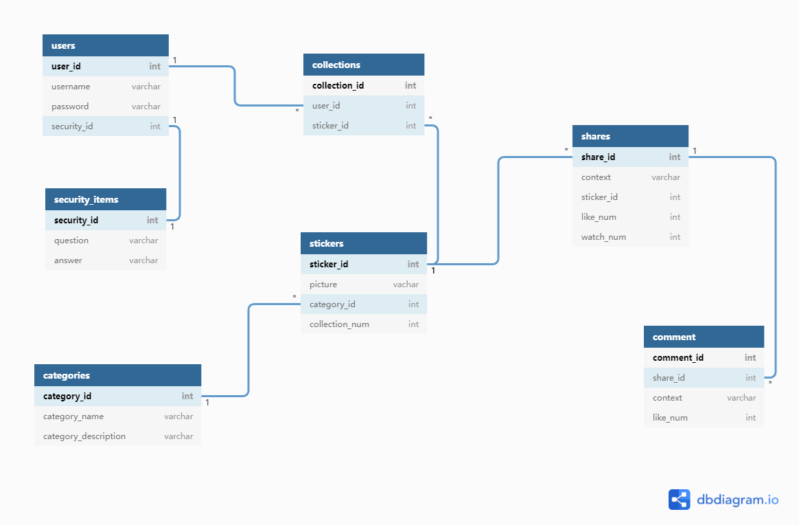

## E-R图设计

使用

[dbdiagram.io]: https://dbdiagram.io/

由表生成ER模型

**用户users：**

user_id：用户的id

username：用户名

password：用户的密码

security_id: 密保问题的id

**密保问题库security：**

security_id：密保问题的id

question：问题

answer：答案

**表情包sticker：**

sticker_id: 表情包的id

picture: 表情包的内容

category_id: 类别

collection_num: 收藏次数

**收藏collections：**

collection_id: 收藏条目id

user_id：用户id

sticker_id: 表情包

**类别category：**

category_id：类别id

category_name: 类别的名字

category_description： 类别的描述

**分享内容share：**

share_id:

context:  文本内容

sticker_id: 表情包id

like_num: 点赞次数

watch_num: 查看次数

**评论comment：**

comment_id:  评论id

share_id:  分享id

context:  文本

like_num: 点赞次数

